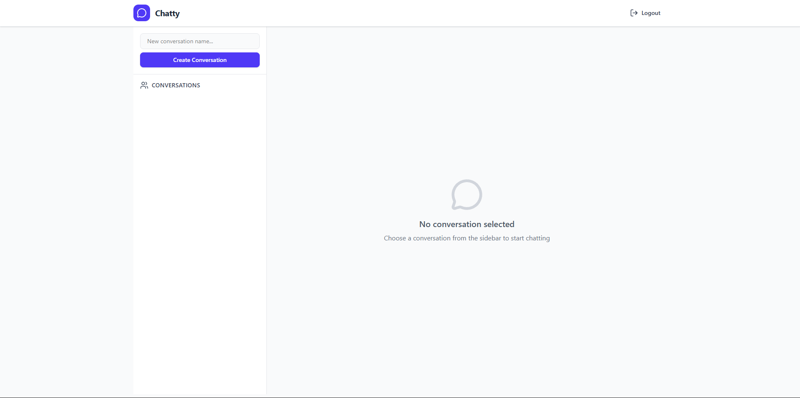
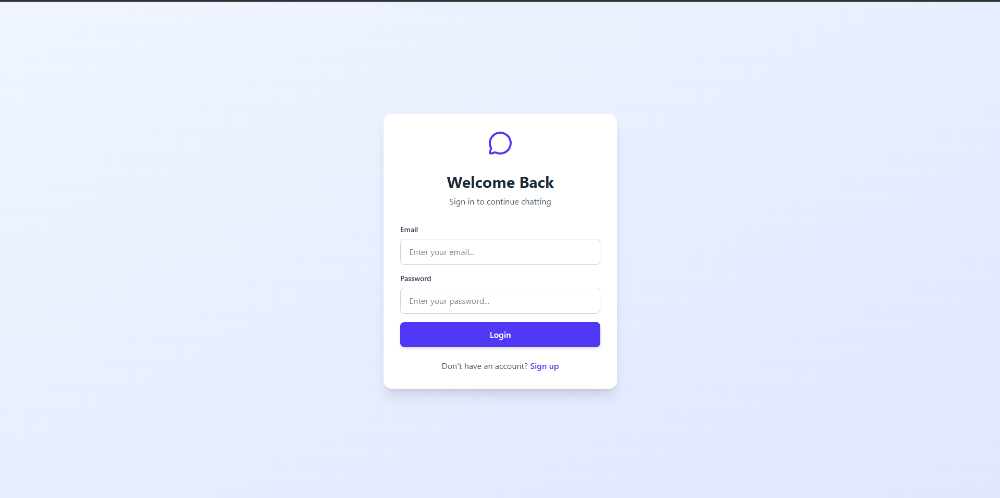

# 💬 Chatty v1 – Real-Time Chat Application

Chatty v1 is a **full-stack real-time chat application** built using **FastAPI**, **React**, and **WebSockets**.
The primary goal of this project was to **understand and implement WebSocket-based real-time communication** while following clean backend and frontend architecture.

This is a **hobby + learning project**, focused on backend correctness, WebSocket integration, and authentication flows.

---

## 🧠 How WebSockets Work in Chatty

* Test it now: https://chat-app-using-fast-api-web-sockets.vercel.app/

---
## 🚀 Features

* 🔐 **JWT Authentication**

  * Access & Refresh token flow
  * Secure protected routes
* 💬 **Real-Time Messaging**

  * WebSocket-based bi-directional communication
  * Messages broadcasted instantly to all users in a conversation
* 🗂️ **Conversations**

  * Create and list conversations
  * Messages grouped by conversation
* 👤 **User Management**

  * Register & login
  * Fetch current logged-in user
* 🗄️ **Persistent Storage**

  * Messages and users stored in PostgreSQL
* 🎨 **Responsive UI**

  * Built with React + Tailwind CSS
  * Mobile-friendly layout

---

## 🛠️ Tech Stack

### Backend

* **FastAPI**
* **WebSockets**
* **SQLModel / SQLAlchemy**
* **PostgreSQL (Neon)**
* **JWT (Access + Refresh tokens)**
* **Uvicorn**

### Frontend

* **React**
* **Axios**
* **Tailwind CSS**
* **WebSocket API**

### Hosting

* **Backend:** Render
* **Frontend:** Vercel
* **Database:** Neon (PostgreSQL)

---

## 🧠 How WebSockets Work in Chatty

* A WebSocket connection is established when a user selects a conversation.
* The backend accepts the connection using `websocket.accept()`.
* Each connected client is stored in memory per conversation.
* Messages are:

  1. Received from the client
  2. Stored in the database
  3. Broadcasted to all connected clients in that conversation
* When a user disconnects, the socket is removed from memory.

> WebSockets are used **only for real-time delivery**.
> Persistence is handled separately via the database.

---

## 🔐 Authentication Flow

1. User logs in → receives **access token**
2. Access token is sent in `Authorization` header
3. If access token expires:

   * `/refresh` endpoint issues a new access token
4. Protected routes require a valid JWT

---

## 📂 Project Structure

### Backend

```
backend/
│── main.py          # FastAPI app, routes, WebSocket logic
│── auth.py          # JWT & password utilities
│── requirements.txt
```

### Frontend

```
frontend/
│── src/
│   ├── api/         # Axios API calls
│   ├── pages/       # Login, Chat pages
│   ├── components/  # UI components
│   ├── App.jsx
│   └── main.jsx
```

---

## 🧪 Local Setup

### Backend

```bash
git clone "https://github.com/kartavya21-dot/ChatApp-using-FastAPI-WebSockets"
cd backend
python -m venv venv
source venv/bin/activate
pip install -r requirements.txt
uvicorn main:app --reload
```

### Frontend

```bash
cd frontend
npm install
npm run dev
```

---

## 🌱 Environment Variables

### Backend (`.env`)

```
DATABASE_URL=postgresql://...
SECRET_KEY=your_secret_key
ALGORITHM=HS256
```

### Frontend (`.env`)

```
VITE_API_URL=https://your-backend-url
VITE_WS_URL=wss://your-backend-url
```

---
## ⚠️ Screenshots

* 
* 
* 
---

## ⚠️ Known Limitations

* WebSocket connections are stored **in-memory**

* Not horizontally scalable (no Redis/PubSub yet)
* WebSocket authentication is basic (token passed via query params)
* No message deletion/editing (by design for v1)

---

## 🎯 What I Learned

* WebSocket lifecycle management
* JWT authentication with refresh tokens
* Handling real-time state in React
* Backend–frontend integration
* Debugging production issues (CORS, cookies, deployment)

---

## 🔮 Future Improvements

* Redis Pub/Sub for WebSocket scaling
* Typing indicators & read receipts
* Message deletion & reactions
* Better WebSocket authentication
* Group chat permissions

---

## 🧑‍💻 Author

**Kartavya Sharma**
Computer Science Undergraduate
Focused on Backend, Distributed Systems & Real-Time Applications